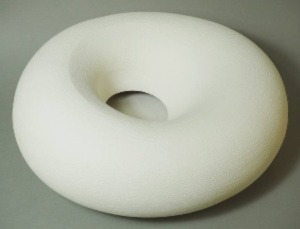

     

          

               
          

          
Lacuna, Stoneware, 37 cm x 22 cm
          

     

# Statement

Andrew creates minimalist ceramic forms using porcelain and high fired stoneware. He employs a colour palette from pure white through to vivid primary colours. He enjoys both the technical challenge of ceramics and the tactile quality of the finished surface.

Andrew’s work is divided into a number of different series which vary from forms made on the wheel which reference traditional pottery to abstract sculptural pieces. Some are intended as large single pieces while others form groups of related objects where no two are alike.

Evidence of process is an important consideration and the memory of the hand is still visible in the final works and is a vital part of their nature. Working with the minimal use of tools allows Andrew to investigate the balance between control and the element of chance and how these seemingly opposite qualities can be combined in a complementary way.

©2023 Andrew Temple Smith 

# Bio

After graduating from his first degree in Environmental Sciences at the University of East Anglia, Andrew did research work at Friends of the Earth and later taught English at a secondary school in Sudan where he lived in a mud hut and learnt the art of living simply. 

Financial imperatives drew Andrew into a career in IT consultancy. Searching for a creative outlet in addition to work, Andrew began the part time study of ceramics at City and Islington College in 2004. Since moving to Bath with his family in 2005, he has continued his ceramic practice from his own studio. In 2011 he began an MA in Ceramics from Bath Spa University, which he completed with a distinction. The master’s degree brought a much greater understanding of the potential of ceramics and lead to a move from domestic work to contemplative pieces and sculptural forms.

Ceramics is a confluence of form and surface, and Andrew puts his science background to use in developing a wide variety of new surface treatments for ceramics including glazes, engobes, slips and terra sigillata.

## Media / Links

[Gallery Nine](https://www.galleryninebath.com/andrew-temple-smith/)

[Saatchi Art](https://www.saatchiart.com/andrewtemplesmith/)

[homify](https://www.homify.co.uk/professionals/48454/andrew-temple-smith-ceramics)

[Lane House Arts](http://www.lanehousearts.co.uk/andrew-temple-smith-artist-page.html/)

